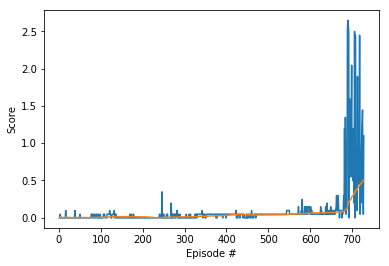

## Deep Deterministic Policy Gradient

### 1. Learning Algorithm

  - DDPG<sup>1</sup> is a different kind of actor-critic method. It could be seen as an approximate DQN instead of an actual actor-critic. This is because the critic in DDPG is used to approximate the maximizer over the Q values of the next state and not as a learned baseline.
  - One of the DQN agent's limitations is that it is not straightforward to use in continuous action spaces. Imagine a DQN network that takes the state and outputs the action-value function. For example, for two actions, say, up and down, ```Q(S, "up")``` gives you the estimated expected value for selecting the up action in state ```S```, say ```-2.18```. ```Q(S,  "down")``` gives you the estimated expected value for choosing the down action in state ```S```, say ```8.45```. To find the max action-value function for this state, you just calculate the maximum of these values. Pretty easy. It's straightforward to do a ```max``` operation in this example because this is a discrete action space. Even if you had more actions say a left, a right, a jump, and so on, you still have a discrete action space. Even if it were high dimensional with many, many more actions, it would still be feasible. But how do you get the value of continuous action with this architecture? Say you want the jump action to be continuous, a variable between ```1``` and ```100``` centimeters. How do you find the value of jump, say ```50``` centimeters? This is one of the problems DDPG solves.
  - In DDPG, we use two deep neural networks: the actor and the critic.
    - The actor here is used to approximate the optimal policy deterministically. That means we want to always output the best-believed action for any given state. This is unlike stochastic policies in which we want the policy to learn a probability distribution over the actions. In DDPG, we want the believed the best action every single time we query the actor network. That is a deterministic policy. The actor is learning the ```argmax Q(S, a)```, which is the best action.
    - The critic learns to evaluate the optimal action-value function by using the actor's best-believed action. Again, we use this actor, an approximate maximizer, to calculate a new target value for training the action-value function, much like DQN does.
  - How to adapt the single-agent auto techniques to the multi-agent case?
    - The simplest approach should be to train all the agents independently without considering the existence of other agents. In this approach, any agent considers all the others to be a part of the environment and learns its own policy. Since all are learning simultaneously, the environment as seen from the prospective of a single agent, changes dynamically. This condition is called non-stationarity of the environment. In most single agent algorithms, it is assumed that the environment is stationary, which leads to certain convergence guarantees. Hence, under non-stationarity conditions, these guarantees no longer hold.
    - The second approach is the multi agent approach. The multi agent approach takes into account the existence of multiple agents. Here, a single policy is lowered for all the agents. It takes as input the present state of the environment and returns the action of each agent in the form of a single joint action vector. The joint action space would increase exponentially with the number of agents. If the environment is partially observable or the agents can only see locally, each agent will have a different observation of the environment state, hence it will be difficult to disambiguate the state of the environment from different local observations. So this approach works well only when each agent knows everything about the environment.

### 2. Model Architecture for the Neural Network
  - #### Actor Network
    |Layer        | Input/Output Sizes | Activation Function      |
    | ----------- | -----------        | -----------              |
    | Linear      | (24, 128)          | Leaky-relu               |
    | Linear      | (128, 128)         | Leaky-relu               |
    | Linear      | (128, 128)         | Leaky-relu               |
    | Linear      | (128, 2)           | Tanh                     |

  - #### Critic Network
    |Layer        | Input/Output Sizes | Activation Function      |
    | ----------- | -----------        | -----------              |
    | Linear      | (48, 128)          | Leaky-relu               |
    | Linear      | (132, 128)         | Leaky-relu               |
    | Linear      | (132, 128)         | Leaky-relu               |
    | Linear      | (128, 1)           |                          |

### 3. Hyperparameters
  - #### Replay buffer size
    - BUFFER_SIZE = int(1e5)
  - #### Minibatch size
    - BATCH_SIZE = 128
  - #### Discount factor
    - GAMMA = 0.99
  - #### For soft update of target parameters
    - TAU = 1e-3
  - #### Learning rate
    - LR = 5e-4
  - #### learning rate of the actor
    - LR_ACTOR = 1e-5
  - #### learning rate of the critic
    - LR_CRITIC = 1e-4
  - #### L2 weight decay
    - WEIGHT_DECAY = 0
  - #### update every UPDATE_EVERY time steps
    - UPDATE_EVERY = 1

## Plot of Rewards
The environment was solved in 1200 episodes.



## Ideas for Future Work

- Distributed Prioritized Experience Replay<sup>5</sup>: I have adopted experience replay in the DQN. But some of these experiences may be more important for learning than others. Moreover, these important experiences might occur infrequently. If we sample the batches uniformly, then these experiences have a very small chance of getting selected. Since buffers are practically limited in capacity, older important experiences may get lost. I will implement prioritized experience replay<sup>4</sup> will help to optimize the selection of experiences.
- Reinforcement Learning with Prediction-Based Rewards<sup>6</sup>
- Proximal Policy Optimization<sup>7</sup>
- OpenAI Five<sup>8</sup>
- Curiosity-driven Exploration by Self-supervised Prediction<sup>9</sup>

References:

1. Lillicrap, Hunt, et al. "Continuous control with deep reinforcement learning." 2015. https://arxiv.org/abs/1509.02971

2. Riedmiller, Martin. "Neural fitted Q iteration–first experiences with a data efficient neural reinforcement learning method." European Conference on Machine Learning. Springer, Berlin, Heidelberg, 2005. http://ml.informatik.uni-freiburg.de/former/_media/publications/rieecml05.pdf

3. Mnih, Volodymyr, et al. "Human-level control through deep reinforcement learning." Nature518.7540 (2015): 529. http://www.davidqiu.com:8888/research/nature14236.pdf

4. Mnih,  Kavukcuoglu, et al. "Playing Atari with Deep Reinforcement Learning." https://www.cs.toronto.edu/~vmnih/docs/dqn.pdf

5. Schaul, Quan, et al. "Prioritized Experience Replay." ICLR (2016). https://arxiv.org/abs/1511.05952

6. https://openai.com/blog/reinforcement-learning-with-prediction-based-rewards/

7. https://openai.com/blog/openai-baselines-ppo/

8. https://openai.com/blog/openai-five/

9.  https://pathak22.github.io/noreward-rl/